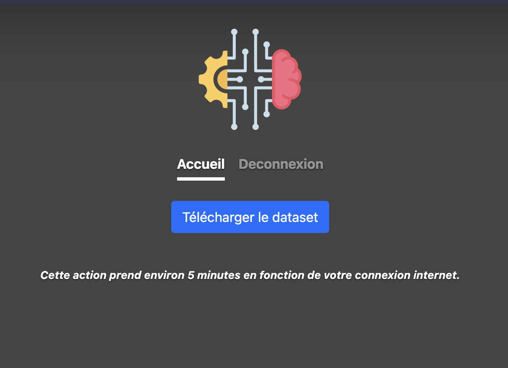

# ReccomendAI - Système de recommandation basé sur l'apprentissage automatique

## Objectifs

L'objectif de ce projet est de créer un système de recommandation basé sur des algorithmes d'apprentissage automatique pour recommander des images en fonction des préférences de l'utilisateur.

## Déploiement manuel

1. Clonez le référentiel du projet en utilisant la commande suivante : `git clone https://github.com/hbourget/RecommendAI.git`
2. Accédez au répertoire du projet : `cd RecommendAI`
3. Installez les dépendances requises : `pip install -r requirements.txt`
4. Accédez au répertoire "bigdata" : `cd bigdata`
5. Lancez le serveur : `python manage.py runserver`

## Déploiement avec Docker

1. Clonez le référentiel du projet en utilisant la commande suivante : `git clone https://github.com/hbourget/RecommendAI.git`
2. Accédez au répertoire du projet : `cd RecommendAI`
3. Assurez-vous d'avoir Docker et Docker Compose installés sur votre ordinateur.
4. Dans une invite de commande, exécutez la commande suivante : `docker-compose up -d`
5. Laissez les conteneurs télécharger les fichiers nécessaires au fonctionnement de l'algorithme de recommandation.

## Fonctionnement des Dockerfiles et Docker Compose

### Dockerfile : python/Dockerfile

Le premier Dockerfile est utilisé pour créer une image Docker permettant d'exécuter une application Python spécifique. Ce Dockerfile contient un script Python appelé `function.py`, qui effectue les tâches suivantes :

  - Téléchargement du dataset d'Unsplash.
  - Décompression du fichier téléchargé.
  - Téléchargement des images contenues dans le fichier `photo.tsv000`.
  - Analyse de chaque image pour extraire les métadonnées et les éléments caractérisant l'image, tels que les paysages (lac, eau, forêt, etc.).
  - Insertion des métadonnées et des éléments caractéristiques de chaque image dans la base de données MongoDB.

Voici comment il fonctionne :

- `FROM python:3.11-slim`: Spécifie l'image de base à utiliser, dans ce cas, `python:3.11-slim` qui est une version récente et légère de Python.

- `WORKDIR /app`: Définit le répertoire de travail à l'intérieur du conteneur comme `/app`.

- `COPY requirements.txt .`: Copie le fichier `requirements.txt` (qui contient les dépendances Python nécessaires) dans le conteneur.

- `RUN pip install --no-cache-dir --upgrade -r requirements.txt`: Exécute la commande `pip install` pour installer les dépendances spécifiées dans `requirements.txt`. L'option `--no-cache-dir` permet de réduire la taille de l'image Docker en évitant de conserver le cache des packages téléchargés. L'option `--upgrade` assure que les packages sont à jour.

- `COPY function.py .`: Copie le fichier `function.py` dans le conteneur.

- `CMD ["python", "function.py"]`: Définit la commande à exécuter lorsque le conteneur est lancé. Dans ce cas, il exécute le fichier `function.py` en utilisant Python

.

Ce Dockerfile est utilisé pour construire une image Docker contenant l'application Python avec ses dépendances et son script `function.py`. Lorsque le conteneur est exécuté, il lance le script `function.py`.

### Dockerfile : webui/Dockerfile

Ce Dockerfile est utilisé pour créer une image Docker permettant d'exécuter une interface utilisateur Web en utilisant le framework Django (web UI). Cette image contient toutes les dépendances nécessaires à l'exécution de l'interface Web, ainsi que les fonctionnalités requises pour effectuer les recommandations d'images à l'utilisateur.

Voici comment il fonctionne :

- `FROM python:3.11-slim`: Spécifie l'image de base à utiliser, dans ce cas, `python:3.11-slim` qui est une version récente et légère de Python.

- `WORKDIR /app`: Définit le répertoire de travail à l'intérieur du conteneur comme `/app`.

- `COPY requirements.txt .`: Copie le fichier `requirements.txt` dans le conteneur.

- `RUN pip install --no-cache-dir --upgrade -r requirements.txt`: Exécute la commande `pip install` pour installer les dépendances spécifiées dans `requirements.txt`. L'option `--no-cache-dir` permet de réduire la taille de l'image Docker en évitant de conserver le cache des packages téléchargés. L'option `--upgrade` assure que les packages sont à jour.

- `COPY . .`: Copie tous les fichiers source (probablement l'ensemble de l'application web) dans le conteneur.

- `CMD ["python", "manage.py", "runserver"]`: Définit la commande à exécuter lorsque le conteneur est lancé. Dans ce cas, il exécute la commande `python manage.py runserver` pour démarrer le serveur web de l'application.

Ce Dockerfile est utilisé pour construire une image Docker contenant l'application web avec ses dépendances. Lorsque le conteneur est exécuté, il lance le serveur web de l'application.

### Docker Compose : docker-compose.yml

Le fichier docker-compose.yml est utilisé pour décrire et exécuter plusieurs services Docker. Voici comment il fonctionne :

- `version: '3.8'`: Spécifie la version de la syntaxe Docker Compose utilisée.

- `services`: Définit les différents services (conteneurs) à exécuter.

  - `app`: Le service "app" est basé sur l'image construite à partir du Dockerfile dans le répertoire `python`. Il utilise le conteneur "mongo" et monte un volume pour stocker les données.

  - `mongo`: Le service "mongo" utilise l'image Docker officielle de MongoDB. Il monte un volume pour stocker les données de la base de données MongoDB et expose le port 27017.

  - `mongo-express`: Le service "mongo-express" utilise l'image Docker de Mongo Express, qui est une interface utilisateur pour MongoDB. Il dépend du service "mongo" et expose le port 8081.

  - `web`: Le service "web" est basé sur l'image construite à partir du Dockerfile dans le répertoire `webui`. Il utilise le conteneur "mongo" et monte des volumes pour le code source de l'application et les données. Il expose le port 8000 et effectue également une vérification de santé

 en vérifiant si le serveur web est accessible.

Ce fichier docker-compose.yml définit la configuration pour exécuter plusieurs services Docker interconnectés. Il crée les conteneurs nécessaires pour exécuter l'application Python, la base de données MongoDB et l'interface utilisateur Web, en configurant les dépendances entre eux et en spécifiant les volumes et les ports nécessaires.

## Fonctionnement

L'application est disponible sur `localhost:8000`. Elle est composée de 3 pages :

- La page d'authentification
- La page d'accueil / recommandation

**Page d'accueil sans le dataset :**

**Page d'accueil avec le dataset déjà téléchargé :**

Si le dataset est déjà téléchargé, il sera détecté automatiquement. Vous pouvez ensuite commencer à aimer ou à ne pas aimer les images aléatoirement proposées afin d'entraîner le modèle. Avec le temps, le modèle deviendra de plus en plus précis et les images proposées seront de plus en plus pertinentes par rapport aux goûts de l'utilisateur.

### Collecte de données

La collecte de données est une étape importante dans la création d'un système de recommandation. Les données peuvent être collectées à partir de diverses sources telles que des sites web, des applications mobiles ou des bases de données existantes. Dans ce projet, la méthode de collecte des données n'est pas spécifiée.

### Étiquetage et annotation

Une fois que les données sont collectées, il est nécessaire de les étiqueter et de les annoter. Cela implique d'attribuer des étiquettes ou des catégories aux données afin de permettre au modèle d'apprentissage automatique de les comprendre. Dans le contexte de ce projet, les images peuvent être étiquetées manuellement en fonction de leur contenu ou de leur catégorie.

### Analyses de données

Avant de construire le système de recommandation, il est essentiel d'effectuer des analyses approfondies des données. Cela peut inclure des statistiques descriptives, des visualisations de données et des techniques d'exploration de données pour mieux comprendre les caractéristiques et les tendances des données.

### Visualisation des données

La visualisation des données joue un rôle crucial dans la compréhension des données et la communication des résultats. Elle permet de représenter graphiquement les informations clés et de découvrir des modèles ou des relations entre les données. Dans ce projet, des captures d'écran de l'interface graphique sont fournies pour illustrer l'apparence de l'application.

### Système de recommandation

Le cœur du projet est le système de recommandation lui-même. Il utilise des algorithmes d'apprentissage automatique pour analyser les préférences de l'utilisateur et recommander des images pertinentes. En utilisant les données collectées, étiquetées et analysées, le modèle de recommandation peut s'améliorer au fil du temps en ajustant ses prédictions en fonction des réactions et des interactions de l'utilisateur.

# SUJET PROJET BIGDATA

# Projet

## Objectifs

- Mise en place d'un [système de recommandation](https://en.wikipedia.org/wiki/Recommender_system) bien commenté en Python
- Rédaction du rapport de projet.

## Projet partie 1

L'object

if de ce projet est de recommander des images en fonction des préférences de l'utilisateur. Vous disposez de trois séances pratiques pour construire ce système. Vous devez vous assurer que toutes les tâches liées à l'acquisition, l'annotation, l'analyse et la visualisation des données sont automatisées.

Les principales tâches du projet sont présentées ci-dessous :

1. Collecte de données
2. Étiquetage et annotation
3. Analyses de données
4. Visualisation des données
5. Système de recommandation
6. Tests
7. Rapport

### Collecte de données

Vous devez collecter et télécharger un ensemble d'images. Vous avez les tâches suivantes à programmer, en automatisant le processus autant que possible :

1. Créer un dossier appelé "images".
2. Télécharger les images sous licence ouverte dans le dossier "images" (minimum 100 images).
3. Enregistrer les métadonnées de chaque image comme la taille de l'image, le format de l'image (.jpeg, .png, etc.), l'orientation de l'image (paysage, portrait, carré, etc.), la date de création, le modèle d'appareil photo, etc. dans un ou plusieurs fichiers JSON. Vous pouvez utiliser les informations [Exif](https://en.wikipedia.org/wiki/Exif) présentes dans les fichiers d'images.

### Étiquetage et annotation

Pour cette tâche, vous devez rechercher les sources disposant d'informations supplémentaires comme les balises, les catégories, etc.

Dans cette tâche, vous devrez peut-être étiqueter, annoter et enregistrer des informations sur chaque image. Vous pouvez analyser les images en utilisant des algorithmes de regroupement pour trouver les couleurs prédominantes.

Vous disposez déjà de certaines métadonnées provenant de l'EXIF des images de la précédente tâche. Dans cette tâche, votre objectif est d'obtenir des informations supplémentaires, comme les couleurs prédominantes, les tags. Et si vous demandiez aux utilisateurs de tagger les images ? Par exemple, les noms de couleurs, #cat, #fleur, #sous-fleur, rose, etc.

Comment prévoyez-vous de traiter ces tags ? Est-il possible d'automatiser ce processus ?

### Analyses de données

Demandez à l'utilisateur de sélectionner quelques images et d'ajouter des balises. Pour chaque utilisateur, vous êtes maintenant prêt à construire un profil de préférences d'utilisateur, basé sur cette sélection. Vous pouvez recueillir les informations suivantes manuellement, mais l'objectif de cette tâche consiste à les obtenir en utilisant les images sélectionnées de manière automatisée :

1. Couleurs préférées
2. Orientation de l'image préférée
3. Tailles d'images préférées (vignettes, grandes images, images de taille moyenne, etc.)
4. Balises favorites
5. ...

Maintenant, grâce à votre connaissance des différents types de classificateurs et les algorithmes de regroupement, quelles informations supplémentaires ajouterez-vous pour chaque image ?

Votre prochain objectif est d'analyser les informations des utilisateurs et leurs images préférées. Comment avez-vous créé

 des utilisateurs aléatoires ? Combien d'utilisateurs avez-vous créés ? Quelles informations avez-vous stockées pour chaque utilisateur ? Quels types d'analyses avez-vous effectuées ?

### Visualisation des données

Dans cette tâche, votre objectif est de visualiser les différentes caractéristiques de toutes les images téléchargées.

1. Le nombre d'images disponibles pour chaque année
2. Le nombre d'images disponibles pour les différents types : taille de l'image, orientation des images, modèles d'appareils photo, etc.
3. Caractéristiques des couleurs

Les utilisateurs peuvent également visualiser les informations ci-dessus relatives à leurs images préférées. Dans cette tâche, vous devez également ajouter une fonctionnalité permettant aux utilisateurs de visualiser les informations liées à leur propre profil d'utilisateur.

### Système de recommandation

Êtes-vous maintenant prêt à recommander des images à un utilisateur ? Dans cette tâche, votre objectif est de construire le système de recommandation. Quelle approche avez-vous décidé de prendre ? Filtrage collaboratif, basé sur le contenu ou une approche hybride ? Pour chaque utilisateur, êtes-vous maintenant en mesure de construire un profil d'utilisateur ? Quel type d'information avez-vous utilisé pour établir un profil d'utilisateur ? Qu'est-ce qui manque ? Quelles sont les limites de votre proposition ?

### Tests

Votre prochaine tâche consiste à mettre au point et à effectuer différents tests sur votre proposition système. Les différentes fonctions sont-elles fonctionnelles ? Comment avez-vous testé votre projet ? Comment vérifiez-vous que votre système de recommandation fonctionne ?

### Rapport

Votre tâche finale consiste à préparer un rapport de 5 pages sur le projet (en français ou en anglais) en format PDF, qui détaille les points suivants :

- Le but de votre projet
- Sources des données de vos images et leurs licences.
- Taille de vos données.
- Informations que vous avez décidé de stocker pour chaque image.
- Informations concernant les préférences de l'utilisateur.
- Les modèles d'exploration de données et/ou d'apprentissage machine que vous avez utilisés avec les métriques obtenues.
- L'auto-évaluation de votre travail.
- Remarques concernant les séances pratiques, les exercices et les possibilités d'amélioration.
- Conclusion

**Note** : Veuillez ne pas ajouter de programmes (ou de code) dans ce rapport.

### Soumission

- Veuillez ne pas soumettre vos images.
- Renommez votre rapport de projet sous le nom de "Nom1_Nom2_[Nom3].pdf", où "Nom1", "Nom2", etc. sont vos noms.
- Ajoutez votre rapport de projet dans votre dossier de projet.
- Compressez et renommez votre travail de projet comme "Nom1_Nom2_[Nom3].zip", où "Nom1", "Nom2" sont vos noms.
- Soumettez votre projet en ligne.

### Évaluation

Les critères d'évaluation des projets sont indiqués ci-dessous :

1. Collecte de données
   - Approches automatisées de la collecte de données
   - Utilisation d'images sous licence libre
   - Stockage et gestion des images et des métadonnées associées
2. Étiquetage et annotation
   - Approches automatisées de

 l'étiquetage
   - Stockage et gestion des étiquettes et des annotations des images
   - Utilisation d'algorithmes de classification et de regroupement
3. Analyses de données
   - Types d'analyses utilisées
   - Utilisation de Pandas et Scikit-learn
   - Utilisation d'algorithmes d'exploration de données
4. Visualisation des données
   - Types de techniques de visualisation utilisées
   - Utilisation de matplotlib
5. Système de recommandation
   - Stockage et gestion des préférences et du profil de l'utilisateur
   - Utilisation d'algorithmes de recommandation
6. Tests
   - Présence de tests fonctionnels
   - Présence de tests utilisateurs
7. Rapport
   - Clarté de la présentation
   - Présence d'une introduction et d'une conclusion claires, architecture des diagrammes, un résumé des différentes tâches réalisées et des limites
   - Bibliographie

**Remarque** : Vous pouvez consulter des exemples supplémentaires de notebooks et de conteneurs Docker pour vous aider dans la réalisation de votre projet.
